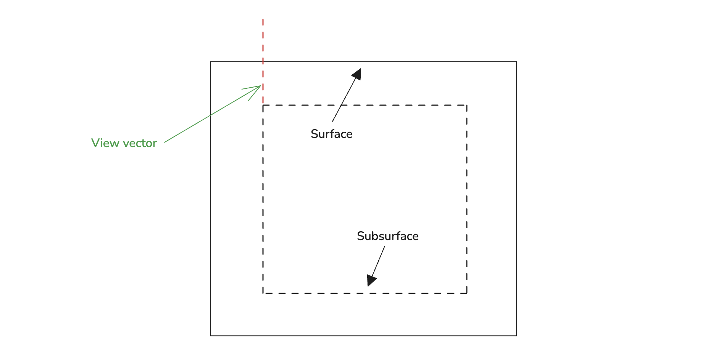

I accidentally stumbled upon a random video and was immediately captivated by the visually striking effect it [showed](https://youtu.be/whyJzrVEgVc?si=dj4ux1Zh0TA0wn1f&t=1690); it also looked simple enough for me to replicate within a few days—thanks to some holiday downtime. I also really wanted to experiment with the [Three.js Shading Language](https://github.com/mrdoob/three.js/wiki/Three.js-Shading-Language). As fate would have it, these factors all came together in the creation of this demo.

I used free assets created by various authors and made some modifications to better suit this demo’s objectives and reduce file sizes for easier web delivery. Below is a list of the original assets and their creators:

- [Crystal Kyber](https://sketchfab.com/3d-models/crystal-kyber-1d769339a8cc45fda2ba6b31ce91160f) by [Ian Diaz](https://sketchfab.com/Dyckzu) - [CC BY 4.0](https://creativecommons.org/licenses/by/4.0/)
- [Crystal Very Noisy Material](https://sketchfab.com/3d-models/crystal-very-noisy-material-d66faac2b1de4fff8221e5ce51f4841d) by [Brett Dow](https://sketchfab.com/BrettDow) - [CC BY 4.0](https://creativecommons.org/licenses/by/4.0/)
- [Crystal Heart](https://sketchfab.com/3d-models/crystal-heart-8e8515a0834b4c1e9e477ce0f392a90c) by [Talaei](https://sketchfab.com/habedi) - [CC BY 4.0](https://creativecommons.org/licenses/by/4.0/)
- [Stone Wall 18](https://www.sharetextures.com/textures/wall/stone-wall-18)
- [Tree Bark Texture 11](https://www.sharetextures.com/textures/wood/tree-bark-11)
- [Lava 06](https://www.sharetextures.com/textures/abstract/lava-06)
- [Marble 32](https://www.sharetextures.com/textures/floor/marble-32)

# Subsurface Refraction Shader Demo

This demo showcases a technique I first came across in this [video](https://youtu.be/whyJzrVEgVc?si=R_Cb48J8CuXa7Emb&t=1672). The technique is outlined by Alexander Sannikov, one of the developers of Path of Exile (PoE) and PoE 2. It was used in PoE for rendering things like water and crystals. The video itself only covers the high-level concept — no deep implementation details — yet it does explain why this method can be superior to other approaches for rendering translucent objects, as well as where it’s most useful.

A similar (or perhaps the same) technique is shown in another [video](https://youtu.be/b5hIzkANWF4?si=BkxgroO_rqa0M9lX). In the [comments](https://www.youtube.com/watch?v=b5hIzkANWF4&lc=Ugw0wmK5vnr5gvyI2P14AaABAg.98_wt7lYrIE98aC0Z__p4d), Alexander explains that he uses a precomputed LUT to approximate scattering events, which is then sampled during rendering. In this project, I decided not to implement those precomputations.

I’m certain the version used in a real game is both more efficient and more complex than what I’m demonstrating here. However, I still find the results of my simpler implementation surprisingly convincing. It’s also worth noting that what I’ve done might not match Alexander’s technique exactly — it’s my own take on the overall idea.

## Rendering Subsurface Material

So, the goal is to render a subsurface in a scattering medium. To make this look believable, we need to capture two major effects:

1. Parallax shift of the subsurface when viewed at different angles
2. Diffuse scattering within the subsurface

Alexander’s idea is that you can think of the subsurface as lying at a fixed depth below the surface — almost like layering a bunch of planes parallel to the outer surface. It’s reminiscent of parallax occlusion mapping, but simpler because we know exactly how far below the surface the subsurface lies. As a result, it’s cheaper computationally. Then you handle the diffuse scattering by changing the mip level of the texture based on how deep the light (or view ray) travels through the material. This creates a shader with constant complexity — no loops required, and a pretty believable effect.

## Implementation Overview

I won’t go into every gritty detail here; you can check out the source code for that. Instead, I’ll focus on the general idea.

### Parallax Shift

What exactly is “parallax shift”? Imagine a three-dimensional translucent surface with a secondary layer (subsurface) underneath it. When you look at this object from different viewing angles, the subsurface appears to shift relative to the outer surface.

In the diagram above, both rays intersect the outer surface at the same point, yet they hit different points on the subsurface. That shift is the parallax effect.

It’s straightforward to compute the vector from the viewing ray’s intersection with the surface to where it intersects the subsurface. Simply multiply the normalized view vector by the ratio of its dot product with the surface normal to the subsurface depth. Initially, I tried using this newly computed offset vector directly to shift the texture coordinates in tangent space (TBN), but ran into issues around sharp normal changes — UV coordinates began showing discontinuities in those areas.

So, instead, I compute the subsurface intersection position in model space and then use triplanar projection to derive the texture coordinates. (This approach is definitely not perfect, and I’ll talk about potential improvements in a bit.)

### Diffuse Scattering

The medium you’re rendering doesn’t have to exhibit diffuse scattering — but when it does, this method offers a notable performance advantage. You simply choose a higher mip level based on how far the ray travels in the material or, in simpler terms, how steep the angle is.

In effect, this means you can render a diffusely scattering medium for less cost than a non-scattering one, because sampling higher mip levels is cheaper than sampling the base texture at full resolution.

### Visibility of Adjacent Faces

Here’s another challenge: sometimes the ray you trace would theoretically exit the geometry, so you shouldn’t see the subsurface from that angle. Without handling this case correctly, you lose the illusion.

To solve this, I use a normal cubemap that’s generated at model load time. This cubemap is used to figure out the expected subsurface normal at a given model-space coordinate. Then I multiply the subsurface color by the dot product between that normal and the view vector. If you check the demo, you’ll see that this simple correction goes a long way toward making the effect look believable.

## Possible Improvements

- **Triplanar Projection**  
  I chose triplanar projection because it doesn’t rely on a tightly matched UV layout. For this demo, I used free models and textures that weren’t designed to go together, so their UV maps don’t align perfectly. If you have models and textures created with consistent UVs in mind, you could potentially get even better results—for instance, by using a cubemap for the subsurface color—and improve performance by reducing texture samples.

- **Normal Mapping**  
  You can easily apply normal maps to the subsurface. In my demo, any texture whose filename has “nm” in it is a normal map.

- **Multiple Subsurfaces**  
  You can render multiple layers of subsurface, each with its own texture (and transparency). Alexander Sannikov actually shows examples of this in another [video](https://youtu.be/TrHHTQqmAaM?si=ESG04p6orajXfgYq&t=260) about Path of Exile 2. It’s not a huge stretch to extend the technique to multiple layers, and it can look absolutely stunning if you have the artistic skills to design such content.

- **Animated Subsurface**  
  In the same video about PoE 2, Alexander demonstrates an approach for animating the texture without creating noticeable artifacts, and even shares [an example implementation](https://www.shadertoy.com/view/mlscz8). If your project calls for it, you can certainly adapt that to bring your subsurface to life — rippling water, shifting crystals, you name it.
